# PaperLite Communication Service 2.0

A robust, scalable microservice for handling multi-channel communications (SMS, WhatsApp, Email) with queue-based processing, Firebase integration, and comprehensive monitoring.

## 🏗️ Architecture Overview

### System Architecture


### Communication Flow Architecture


### Redis Queue Scheduling Architecture


### Detailed Queue Processing Flow


### Firebase Notification Lifecycle


### Redis Queue Configuration Details


### Queue Timing & Scheduling Matrix

```mermaid
gantt
    title Redis Queue Execution Schedule (24 Hour View)
    dateFormat HH:mm
    axisFormat %H:%M
    
    section Hourly Queue
    1hr Execution    :milestone, m1, 00:00, 0min
    1hr Execution    :milestone, m2, 01:00, 0min
    1hr Execution    :milestone, m3, 02:00, 0min
    1hr Execution    :milestone, m4, 03:00, 0min
    1hr Execution    :milestone, m5, 04:00, 0min
    1hr Execution    :milestone, m6, 05:00, 0min
    1hr Execution    :milestone, m7, 06:00, 0min
    1hr Execution    :milestone, m8, 07:00, 0min
    1hr Execution    :milestone, m9, 08:00, 0min
    1hr Execution    :milestone, m10, 09:00, 0min
    1hr Execution    :milestone, m11, 10:00, 0min
    1hr Execution    :milestone, m12, 11:00, 0min
    1hr Execution    :milestone, m13, 12:00, 0min
    1hr Execution    :milestone, m14, 13:00, 0min
    1hr Execution    :milestone, m15, 14:00, 0min
    1hr Execution    :milestone, m16, 15:00, 0min
    1hr Execution    :milestone, m17, 16:00, 0min
    1hr Execution    :milestone, m18, 17:00, 0min
    1hr Execution    :milestone, m19, 18:00, 0min
    1hr Execution    :milestone, m20, 19:00, 0min
    1hr Execution    :milestone, m21, 20:00, 0min
    1hr Execution    :milestone, m22, 21:00, 0min
    1hr Execution    :milestone, m23, 22:00, 0min
    1hr Execution    :milestone, m24, 23:00, 0min
    
    section 3-Hour Queue
    3hr Execution    :crit, milestone, t1, 00:00, 0min
    3hr Execution    :crit, milestone, t2, 03:00, 0min
    3hr Execution    :crit, milestone, t3, 06:00, 0min
    3hr Execution    :crit, milestone, t4, 09:00, 0min
    3hr Execution    :crit, milestone, t5, 12:00, 0min
    3hr Execution    :crit, milestone, t6, 15:00, 0min
    3hr Execution    :crit, milestone, t7, 18:00, 0min
    3hr Execution    :crit, milestone, t8, 21:00, 0min
    
    section 6-Hour Queue
    6hr Execution    :active, milestone, s1, 00:00, 0min
    6hr Execution    :active, milestone, s2, 06:00, 0min
    6hr Execution    :active, milestone, s3, 12:00, 0min
    6hr Execution    :active, milestone, s4, 18:00, 0min
    
    section 12-Hour Queue
    12hr Execution   :done, milestone, tw1, 00:00, 0min
    12hr Execution   :done, milestone, tw2, 12:00, 0min
```



### Firebase Queue Integration Architecture


### Queue Processing Implementation Details


### Service Integration Architecture


### Security & Authentication Flow


### Deployment & Infrastructure


## 🚀 Quick Start

### Prerequisites
- Node.js 20+
- Firebase CLI
- Redis instance
- Environment variables configured

### Installation
```bash
# Clone repository
git clone <repository-url>
cd paperlite_communication_service_2.0

# Install dependencies
cd functions
npm install

# Setup environment
cp .env.example .env.dev
# Configure your environment variables

# Start development server
npm run dev
```

### Environment Variables
```bash
# API Configuration
API_KEYS=PAPERLITE.DEV.your-dev-key,PAPERLITE.PROD.your-prod-key
PORT=3000

# Redis Configuration
REDIS_URL=redis://localhost:6379
REDIS_URL_STRING=false

# MSG91 Configuration
MSG91_AUTH_KEY=your-msg91-auth-key
MSG91_SENDER_ID=your-sender-id
MSG91_COUNTRY_CODE=91

# Email Configuration
GUPSHUP_USERID=your-gupshup-userid
GUPSHUP_PASSWORD=your-gupshup-password
GOOGLE_CLIENT_ID=your-google-client-id
GOOGLE_CLIENT_SECRET=your-google-client-secret
```

## 📊 API Endpoints

### Communication APIs
- `POST /api/communication/send-sms` - Send SMS notification
- `POST /api/communication/send-whatsapp` - Send WhatsApp message
- `POST /api/communication/send-email` - Send email notification
- `POST /api/communication/schedule-notification` - Schedule future notification
- `POST /api/communication/group-notification` - Send grouped notifications
- `POST /api/communication/paperlite-notification` - PaperLite specific notifications

### Health Check
- `GET /` - Service health check
- `GET /redis/:value` - Redis connectivity test

## 🛠️ Development Commands

```bash
# Development
npm run dev          # Start with hot reload
npm run start:dev    # Start with ts-node

# Production
npm run build        # Compile TypeScript
npm run start        # Build and start production

# Code Quality
npm run lint         # Run ESLint
```

## 📈 Monitoring & Logging

The service includes comprehensive logging with Winston:
- **Daily log rotation** with compression
- **Separate error logs** for debugging
- **Performance monitoring** with health checks
- **Queue monitoring** with job status tracking

## 🔧 Configuration

### Queue Configuration
- **Concurrency**: 5 workers per queue
- **Retry Strategy**: 3 attempts with exponential backoff
- **Health Checks**: Every 25 seconds

### Security Features
- **API Key validation** with environment-specific keys
- **Rate limiting** and IP whitelisting
- **Input validation** with express-validator
- **Custom error handling** with proper HTTP status codes
