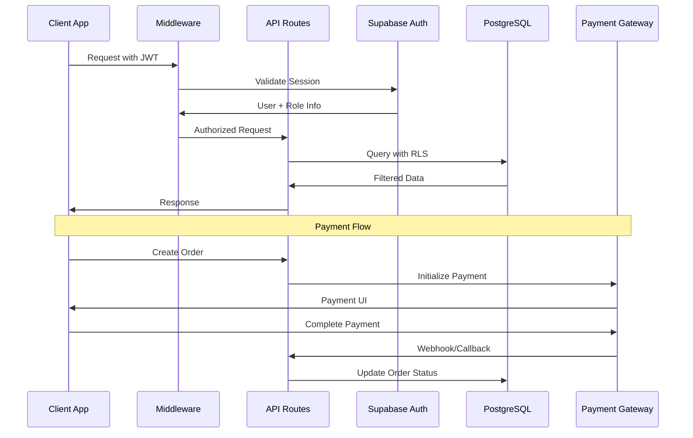

# Campus Dabba - Technical Architecture Overview

## System Architecture Diagram

```mermaid
graph TB
    subgraph "Client Layer"
        WEB[Web App<br/>Next.js 14<br/>React/TypeScript]
        MOBILE[Mobile App<br/>React Native<br/>+ Capacitor]
        DART[Dart/Flutter<br/>Under Development]
    end

    subgraph "API Gateway Layer"
        MIDDLEWARE[Next.js Middleware<br/>Session Management]
        API[API Routes<br/>/app/api/*]
    end

    subgraph "Authentication & Authorization"
        AUTH[Supabase Auth<br/>JWT + RLS]
        ROLES[Role-based Access<br/>Cook | Customer | Admin]
    end

    subgraph "Backend Services"
        SUPABASE[Supabase Pro<br/>PostgreSQL + Storage]
        PAYMENT[Payment Gateway<br/>Razorpay/Stripe]
        STORAGE[File Storage<br/>Supabase Storage]
    end

    subgraph "Database Layer"
        DB[(PostgreSQL Database)]
        RLS[Row Level Security<br/>Policies]
    end

    subgraph "External Services"
        MAPS[Google Maps API<br/>Location Services]
        EMAIL[Email Service<br/>Verification]
    end

    %% Client to API connections
    WEB --> MIDDLEWARE
    MOBILE --> MIDDLEWARE
    DART --> MIDDLEWARE

    %% API Layer connections
    MIDDLEWARE --> API
    API --> AUTH
    API --> SUPABASE
    API --> PAYMENT

    %% Backend connections
    AUTH --> DB
    SUPABASE --> DB
    SUPABASE --> STORAGE
    SUPABASE --> RLS

    %% External integrations
    API --> MAPS
    API --> EMAIL

    %% Data flow
    ROLES -.-> RLS
    AUTH -.-> ROLES

    style WEB fill:#e1f5fe
    style MOBILE fill:#e8f5e8
    style DART fill:#fff3e0
    style SUPABASE fill:#f3e5f5
    style DB fill:#ffebee
```

## Data Flow Architecture



## Core Modules Breakdown

### 1. Authentication & Authorization (`/components/providers/`)
```
auth-provider.tsx          - React context for auth state
auth-provider-simple.tsx   - Simplified auth wrapper
protected-route.tsx        - Route protection HOC
```

**Key Features:**
- JWT-based authentication via Supabase
- Role-based access control (Cook, Customer, Admin)
- Session persistence and refresh
- Loading states and error handling

### 2. API Layer (`/app/api/`)
```
/admin/
  ├── stats/route.ts       - Admin dashboard statistics
  ├── orders/route.ts      - Order management for admins
  ├── users/route.ts       - User management endpoints
  └── cooks/route.ts       - Cook approval and management

/razorpay/
  ├── create-order/route.ts    - Initialize payment
  ├── verify-payment/route.ts  - Verify payment callback
  └── test-order/route.ts      - Testing endpoints

verify-email.ts          - Email verification handler
map.tsx                  - Google Maps integration
```

### 3. Database Layer (`/supabase/migrations/`)
```
Schema Tables:
├── users                - Base user information
├── cooks                - Cook profiles and verification
├── students             - Student/customer profiles
├── admins               - Admin user management
├── orders               - Order tracking and status
├── order_items          - Order line items
├── dabba_menu           - Cook menu items
├── reviews              - Customer reviews and ratings
├── cook_bank_details    - Payment information
└── admin_keys           - Admin access management
```

**Row Level Security (RLS) Policies:**
- User-specific data access
- Role-based table permissions
- Cook-customer data isolation
- Admin oversight capabilities

### 4. Frontend Architecture (`/app/`)

#### User Interfaces by Role:
```
/auth/                   - Authentication flows
├── login/
├── register/
└── verify/

/(static)/               - Public pages
├── about/
├── faq/
└── help/

/cook/                   - Cook interface
├── dashboard/           - Analytics and overview
├── menu/                - Menu management
├── orders/              - Order tracking
├── orderprog/           - Order progress management
└── profile/             - Profile settings

/admin/                  - Admin interface
├── dashboard/           - System overview
├── users/               - User management
├── cooks/               - Cook approval
└── orders/              - Order monitoring

/student/                - Customer interface
├── dashboard/
├── orders/
└── profile/
```

### 5. Utility Modules (`/utils/`, `/lib/`)
```
/utils/
├── supabase/
│   ├── client.ts        - Browser Supabase client
│   ├── server.ts        - Server-side Supabase client
│   ├── service.ts       - Service role client
│   └── middleware.ts    - Session handling middleware
├── razorpay.ts          - Payment integration
└── debounce.ts          - Performance utilities

/lib/
├── utils.ts             - Common utilities
├── supabase-admin.ts    - Admin operations
└── data/                - Static data and configurations
```

### 6. Component Architecture (`/components/`)
```
/components/
├── providers/           - React context providers
├── ui/                  - Reusable UI components (shadcn/ui)
├── auth/                - Authentication forms
├── cook/                - Cook-specific components
├── admin/               - Admin interface components
├── student/             - Customer interface components
├── layout/              - Navigation and layout
├── shared/              - Cross-role components
└── map/                 - Location services
```

## Integration Points

### 1. Payment Processing
- **Primary:** Razorpay integration for Indian market
- **Fallback:** Stripe for international expansion
- **Flow:** Order creation → Payment initialization → Webhook verification → Order fulfillment

### 2. Real-time Features
- **Supabase Realtime:** Order status updates, cook availability
- **Live Data:** Dashboard metrics, order tracking
- **Subscriptions:** Cook order notifications, customer updates

### 3. File Management
- **Supabase Storage:** Profile pictures, menu images, documents
- **CDN:** Optimized image delivery
- **Security:** Role-based file access policies

### 4. Location Services
- **Google Maps API:** Cook location, delivery tracking
- **Geolocation:** Distance calculation, service area validation

## Deployment Architecture

### Current State (Web)
```
Next.js 14 Application
├── Static Site Generation (SSG) for public pages
├── Server-Side Rendering (SSR) for dynamic content
├── API Routes for backend logic
└── Middleware for authentication

Supabase Pro Backend
├── PostgreSQL Database with RLS
├── Authentication service
├── File storage
└── Edge Functions (optional)
```

### Mobile Strategy
```
Current: React Native + Capacitor
├── Shared codebase with web
├── Platform-specific optimizations
└── Native device integrations

Future: Dart/Flutter
├── Native performance
├── Platform-specific UI
└── Backend API consumption
```

## Security Architecture

### 1. Authentication Security
- JWT tokens with configurable expiration
- Secure session management via HTTP-only cookies
- Multi-factor authentication ready infrastructure

### 2. Database Security
- Row Level Security (RLS) policies for all tables
- Role-based data access patterns
- Audit logging for sensitive operations

### 3. API Security
- Middleware-based request validation
- Rate limiting (configurable)
- Input sanitization and validation

### 4. Payment Security
- PCI DSS compliant payment processing
- Webhook signature verification
- Secure credential management

## Performance Considerations

### 1. Frontend Optimization
- Next.js App Router for optimal loading
- Component lazy loading
- Image optimization
- Bundle splitting by role

### 2. Database Optimization
- Indexed queries for common operations
- Connection pooling
- Query optimization for dashboards

### 3. Caching Strategy
- Browser caching for static assets
- API response caching
- Database query result caching

## Monitoring & Analytics

### 1. Application Monitoring
- Error tracking and logging
- Performance metrics
- User behavior analytics

### 2. Business Metrics
- Order completion rates
- Cook onboarding metrics
- Customer satisfaction tracking
- Revenue analytics

---

*This architecture supports a scalable, multi-tenant food delivery platform with clear separation of concerns, robust security, and efficient data flow between all stakeholders.*
