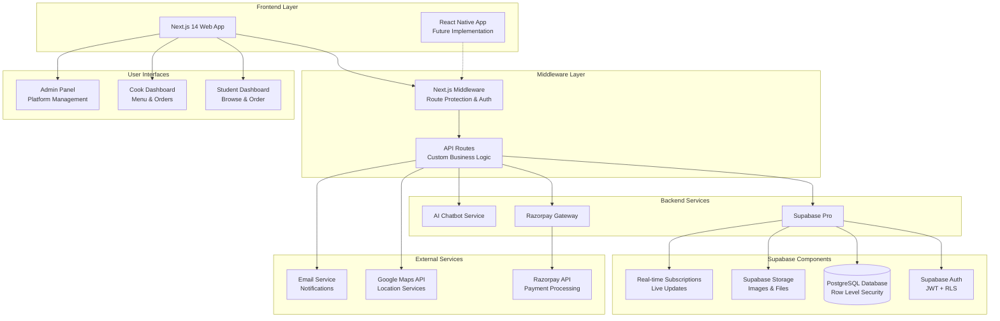
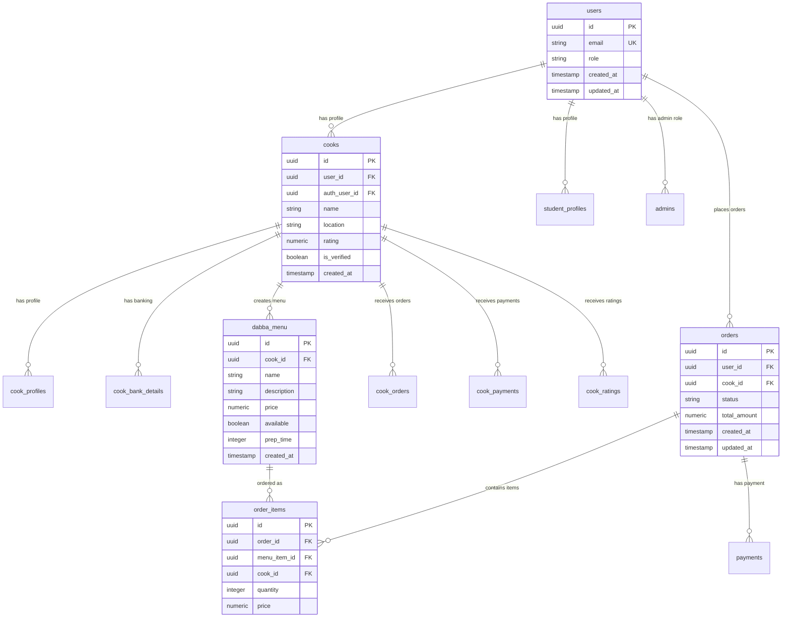
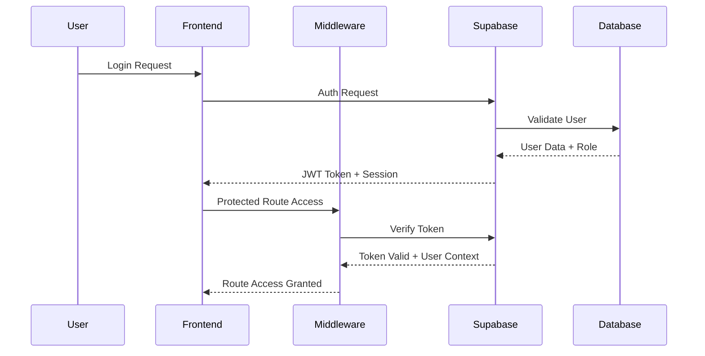
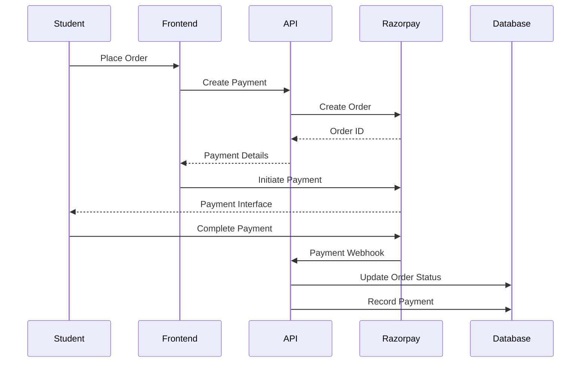
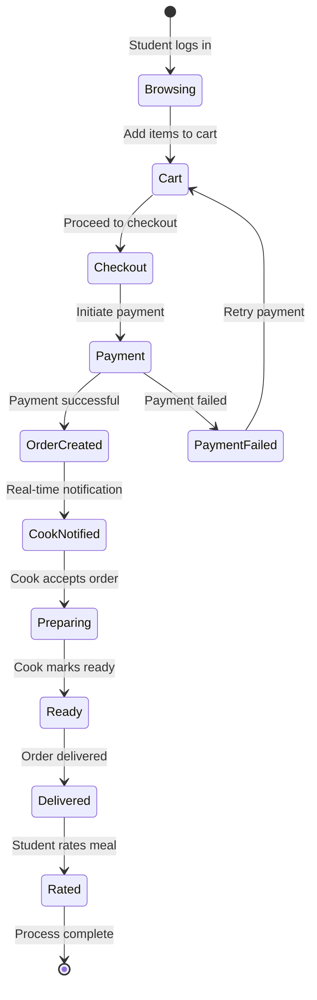

# 🏗️ Campus Dabba - Technical Architecture Overview

## 📋 System Overview

Campus Dabba is a modern full-stack web application built with Next.js 14, TypeScript, and Supabase that connects students with local home cooks for authentic, homemade meal delivery. The platform supports three distinct user roles with role-based access control and real-time features.

## 🎯 Architecture Diagram



## 🏛️ Architectural Layers

### 1. Frontend Layer
```
├── app/                          # Next.js 14 App Router
│   ├── (static)/                # Static pages (about, FAQ, etc.)
│   ├── admin/                   # Admin panel routes
│   ├── auth/                    # Authentication flows
│   ├── cook/                    # Cook dashboard & features
│   ├── student/                 # Student dashboard & features
│   ├── api/                     # API route handlers
│   └── layout.tsx               # Root layout with providers
├── components/                   # Reusable UI components
│   ├── admin/                   # Admin-specific components
│   ├── auth/                    # Authentication components
│   ├── cook/                    # Cook dashboard components
│   ├── student/                 # Student interface components
│   ├── shared/                  # Cross-role shared components
│   ├── providers/               # Context providers
│   └── ui/                      # Base UI components (shadcn/ui)
```

**Key Technologies:**
- **Next.js 14** with App Router for modern React development
- **TypeScript** for type safety and better developer experience
- **Tailwind CSS** for utility-first styling
- **ShadCN UI** for consistent, accessible component library
- **React Hook Form** for efficient form handling
- **Zustand/Context API** for state management

### 2. Middleware & API Layer
```
├── middleware.ts                 # Route protection & session management
├── app/api/                     # Custom API endpoints
│   ├── admin/                   # Admin operations
│   │   ├── users/              # User management
│   │   ├── cooks/              # Cook verification & management
│   │   ├── orders/             # Order oversight
│   │   └── stats/              # Analytics & reporting
│   ├── razorpay/               # Payment processing
│   │   ├── create-order/       # Order creation
│   │   ├── verify-payment/     # Payment verification
│   │   └── test/               # Test endpoints
│   └── verify-email.ts         # Email verification
```

**Responsibilities:**
- Authentication & authorization middleware
- Business logic not suitable for client-side
- Third-party service integrations
- Payment processing and verification
- File upload handling
- Email notifications

### 3. Database & Backend Services

#### Database Schema (PostgreSQL via Supabase)


**Key Database Features:**
- **Row Level Security (RLS)** for data protection
- **Foreign Key Relationships** for data integrity
- **Triggers** for automated updates (cook stats, order counts)
- **Indexes** for optimized queries
- **Unique Constraints** for data consistency

#### Row Level Security Policies
```sql
-- Example policies from policies.json
CREATE POLICY "Users can view their own orders" ON orders
  FOR SELECT USING (auth.uid() = user_id);

CREATE POLICY "Cooks can manage their menu" ON dabba_menu
  FOR ALL USING (auth.uid() = cook_id);

CREATE POLICY "Admin full access" ON ALL TABLES
  FOR ALL USING (is_admin(auth.uid()));
```

### 4. Authentication & Authorization

**Authentication Flow:**


**Role-Based Access Control:**
- **Student/Customer**: Browse cooks, place orders, track orders, rate meals
- **Cook**: Manage menu, view orders, update status, track earnings
- **Admin**: Platform oversight, user management, analytics, system settings

### 5. Payment Processing Architecture



## 📁 Key Code Modules Breakdown

### Core Application Files
```
├── middleware.ts                 # Session management & route protection
├── app/layout.tsx               # Root layout with providers
├── app/page.tsx                 # Landing page
├── lib/
│   ├── supabase-admin.ts        # Admin Supabase client
│   └── utils.ts                 # Utility functions
├── utils/
│   ├── supabase/               # Supabase client configurations
│   │   ├── client.ts           # Client-side Supabase
│   │   ├── server.ts           # Server-side Supabase
│   │   ├── middleware.ts       # Middleware Supabase
│   │   └── service.ts          # Service role Supabase
│   └── razorpay.ts             # Payment utilities
```

### Authentication System
```
├── components/providers/
│   ├── auth-provider.tsx        # Authentication context
│   ├── cart-provider.tsx       # Shopping cart state
│   └── theme-provider.tsx      # Theme management
├── hooks/
│   ├── use-auth.ts             # Authentication hook
│   ├── use-auth-role.ts        # Role-based access hook
│   └── use-mobile.tsx          # Mobile detection
```

### API Route Handlers
```
├── app/api/
│   ├── admin/                  # Admin operations
│   │   ├── cooks/route.ts      # Cook management
│   │   ├── users/route.ts      # User management
│   │   ├── orders/route.ts     # Order oversight
│   │   └── stats/route.ts      # Analytics
│   ├── razorpay/              # Payment processing
│   │   ├── create-order/route.ts
│   │   ├── verify-payment/route.ts
│   │   └── test/route.ts
│   └── verify-email.ts        # Email verification
```

### Database Configuration
```
├── supabase/
│   ├── migrations/            # Database migrations
│   └── full_schema.json       # Complete schema export
├── sql/                       # SQL scripts
│   ├── admin_users_policies.sql
│   └── fix_rls_admin_policies.sql
├── foreign key relationships.json
├── indexes.json
├── primary_unique_keys.json
├── policies.json
├── tables+columns+types.json
└── triggers.json
```

## 🔄 Data Flow Architecture

### Order Processing Flow


### Real-time Updates
- **Order Status Changes**: Immediate updates to student dashboard
- **New Orders**: Instant notifications to cook dashboard
- **Payment Status**: Real-time payment confirmation
- **Inventory Updates**: Live menu availability updates

## 🛡️ Security Architecture

### Authentication Security
- **JWT Tokens** with automatic refresh
- **Row Level Security (RLS)** on all database tables
- **Server-side session validation**
- **Protected API routes** with role verification

### Data Protection
- **Input validation** on all forms
- **SQL injection prevention** via Supabase
- **File upload restrictions** and validation
- **CORS configuration** for API security

### Payment Security
- **PCI DSS compliant** payment processing via Razorpay
- **Webhook signature verification**
- **Secure payment state management**
- **Transaction audit trails**

## 📈 Scalability Considerations

### Performance Optimizations
- **Next.js App Router** for optimal loading
- **Image optimization** with Next.js Image component
- **Database indexing** for fast queries
- **Caching strategies** for frequently accessed data

### Scalability Features
- **Serverless API routes** auto-scale with demand
- **Supabase backend** handles database scaling
- **CDN integration** for static assets
- **Real-time subscriptions** with connection pooling

## 🚀 Deployment Architecture

### Current Setup
- **Frontend**: Vercel/Netlify deployment
- **Backend**: Supabase hosted infrastructure
- **Database**: PostgreSQL on Supabase cloud
- **Storage**: Supabase storage for files
- **CDN**: Automatic via hosting platform

### Environment Configuration
```
├── .env.local                  # Local development
├── .env.example               # Environment template
├── netlify.toml              # Netlify deployment config
└── next.config.mjs           # Next.js configuration
```

## 🔮 Future Enhancements

### Planned Features
- **React Native Mobile App** for enhanced mobile experience
- **Advanced AI Chatbot** with natural language processing
- **Analytics Dashboard** with business intelligence
- **Multi-language Support** for broader accessibility
- **Advanced Search & Filtering** with location-based recommendations

### Technical Improvements
- **Edge Functions** for geo-distributed processing
- **Advanced Caching** with Redis integration
- **Microservices Architecture** for complex business logic
- **GraphQL API** for more efficient data fetching
- **WebSocket Integration** for enhanced real-time features

---

This architecture supports a robust, scalable food delivery platform that can handle thousands of concurrent users while maintaining data security and providing an excellent user experience across all stakeholder roles.
