# 🏗️ Campus Dabba - Technical Architecture Overview

## 📋 System Overview

Campus Dabba is a modern full-stack web application built with Next.js 14, TypeScript, and Supabase that connects students with local home cooks for authentic, homemade meal delivery. The platform supports three distinct user roles with role-based access control and real-time features.

## 🎯 High-Level System Architecture


## 🖥️ Advanced Frontend Architecture


## 🏗️ Advanced Backend Architecture


## 🏛️ Architectural Layers

### 1. Frontend Layer
```
├── app/                          # Next.js 14 App Router
│   ├── (static)/                # Static pages (about, FAQ, etc.)
│   ├── admin/                   # Admin panel routes
│   ├── auth/                    # Authentication flows
│   ├── cook/                    # Cook dashboard & features
│   ├── student/                 # Student dashboard & features
│   ├── api/                     # API route handlers
│   └── layout.tsx               # Root layout with providers
├── components/                   # Reusable UI components
│   ├── admin/                   # Admin-specific components
│   ├── auth/                    # Authentication components
│   ├── cook/                    # Cook dashboard components
│   ├── student/                 # Student interface components
│   ├── shared/                  # Cross-role shared components
│   ├── providers/               # Context providers
│   └── ui/                      # Base UI components (shadcn/ui)
```

**Key Technologies:**
- **Next.js 14** with App Router for modern React development
- **TypeScript** for type safety and better developer experience
- **Tailwind CSS** for utility-first styling
- **ShadCN UI** for consistent, accessible component library
- **React Hook Form** for efficient form handling
- **Zustand/Context API** for state management

### 2. Middleware & API Layer
```
├── middleware.ts                 # Route protection & session management
├── app/api/                     # Custom API endpoints
│   ├── admin/                   # Admin operations
│   │   ├── users/              # User management
│   │   ├── cooks/              # Cook verification & management
│   │   ├── orders/             # Order oversight
│   │   └── stats/              # Analytics & reporting
│   ├── razorpay/               # Payment processing
│   │   ├── create-order/       # Order creation
│   │   ├── verify-payment/     # Payment verification
│   │   └── test/               # Test endpoints
│   └── verify-email.ts         # Email verification
```

**Responsibilities:**
- Authentication & authorization middleware
- Business logic not suitable for client-side
- Third-party service integrations
- Payment processing and verification
- File upload handling
- Email notifications

### 3. Database & Backend Services

#### Database Schema (PostgreSQL via Supabase)


**Key Database Features:**
- **Row Level Security (RLS)** for data protection
- **Foreign Key Relationships** for data integrity
- **Triggers** for automated updates (cook stats, order counts)
- **Indexes** for optimized queries
- **Unique Constraints** for data consistency

#### Row Level Security Policies
```sql
-- Example policies from policies.json
CREATE POLICY "Users can view their own orders" ON orders
  FOR SELECT USING (auth.uid() = user_id);

CREATE POLICY "Cooks can manage their menu" ON dabba_menu
  FOR ALL USING (auth.uid() = cook_id);

CREATE POLICY "Admin full access" ON ALL TABLES
  FOR ALL USING (is_admin(auth.uid()));
```

### 4. Authentication & Authorization

**Authentication Flow:**


**Role-Based Access Control:**
- **Student/Customer**: Browse cooks, place orders, track orders, rate meals
- **Cook**: Manage menu, view orders, update status, track earnings
- **Admin**: Platform oversight, user management, analytics, system settings

### 5. Payment Processing Architecture


## 📁 Detailed Code Architecture

### Frontend Component Hierarchy
```
src/
├── app/                                    # Next.js 14 App Router
│   ├── layout.tsx                         # Root layout with providers
│   ├── page.tsx                           # Landing page
│   ├── loading.tsx                        # Global loading UI
│   ├── error.tsx                          # Global error boundary
│   ├── not-found.tsx                      # 404 page
│   │
│   ├── globals.css                        # Global styles & Tailwind
│   │
│   ├── (static)/                          # Static marketing pages
│   │   ├── layout.tsx                     # Static pages layout
│   │   ├── about/page.tsx                 # About page
│   │   ├── careers/page.tsx               # Careers page
│   │   ├── faq/page.tsx                   # FAQ page
│   │   ├── help/page.tsx                  # Help center
│   │   └── support/page.tsx               # Support page
│   │
│   ├── auth/                              # Authentication flows
│   │   ├── login/page.tsx                 # Login form
│   │   ├── register/page.tsx              # Registration form
│   │   ├── admin-register/page.tsx        # Admin registration
│   │   ├── verify/page.tsx                # Email verification
│   │   └── registration/page.tsx          # Registration success
│   │
│   ├── student/                           # Student interface
│   │   ├── layout.tsx                     # Student layout wrapper
│   │   ├── dashboard/page.tsx             # Student dashboard
│   │   ├── browse/page.tsx                # Browse cooks
│   │   ├── menu/[cookId]/page.tsx         # Cook menu view
│   │   ├── cart/page.tsx                  # Shopping cart
│   │   ├── checkout/page.tsx              # Checkout process
│   │   ├── orders/page.tsx                # Order history
│   │   ├── orders/[orderId]/page.tsx      # Order details
│   │   ├── profile/page.tsx               # Profile management
│   │   └── settings/page.tsx              # Account settings
│   │
│   ├── cook/                              # Cook interface
│   │   ├── layout.tsx                     # Cook layout wrapper
│   │   ├── register/page.tsx              # Cook registration flow
│   │   ├── registration/page.tsx          # Registration steps
│   │   ├── dashboard/page.tsx             # Cook dashboard
│   │   ├── menu/page.tsx                  # Menu management
│   │   ├── menu/create/page.tsx           # Add menu item
│   │   ├── menu/edit/[itemId]/page.tsx    # Edit menu item
│   │   ├── orders/page.tsx                # Order management
│   │   ├── orders/[orderId]/page.tsx      # Order details
│   │   ├── orderprog/page.tsx             # Order progress tracking
│   │   ├── payments/page.tsx              # Payment history
│   │   ├── profile/page.tsx               # Cook profile
│   │   └── settings/page.tsx              # Account settings
│   │
│   ├── admin/                             # Admin panel
│   │   ├── layout.tsx                     # Admin layout wrapper
│   │   ├── dashboard/page.tsx             # Admin dashboard
│   │   ├── users/page.tsx                 # User management
│   │   ├── users/[userId]/page.tsx        # User details
│   │   ├── cooks/page.tsx                 # Cook management
│   │   ├── cooks/[cookId]/page.tsx        # Cook verification
│   │   ├── orders/page.tsx                # Order oversight
│   │   ├── orders/[orderId]/page.tsx      # Order details
│   │   ├── payments/page.tsx              # Payment management
│   │   └── settings/page.tsx              # System settings
│   │
│   └── api/                               # API route handlers
│       ├── auth/                          # Authentication endpoints
│       ├── admin/                         # Admin operations
│       │   ├── users/route.ts             # User management API
│       │   ├── cooks/route.ts             # Cook management API
│       │   ├── orders/route.ts            # Order oversight API
│       │   └── stats/route.ts             # Analytics API
│       ├── razorpay/                      # Payment integration
│       │   ├── create-order/route.ts      # Create payment order
│       │   ├── verify-payment/route.ts    # Verify payment
│       │   └── test/route.ts              # Test endpoints
│       ├── student/                       # Student operations
│       ├── cook/                          # Cook operations
│       └── verify-email.ts                # Email verification
│
├── components/                            # Reusable UI components
│   ├── providers/                         # Context providers
│   │   ├── auth-provider.tsx              # Authentication context
│   │   ├── cart-provider.tsx              # Shopping cart state
│   │   ├── theme-provider.tsx             # Theme management
│   │   └── toast-provider.tsx             # Notification system
│   │
│   ├── layout/                            # Layout components
│   │   ├── main-nav.tsx                   # Main navigation
│   │   ├── cook-nav.tsx                   # Cook navigation
│   │   ├── admin-nav.tsx                  # Admin navigation
│   │   ├── mobile-nav.tsx                 # Mobile navigation
│   │   ├── sidebar.tsx                    # Dashboard sidebar
│   │   └── footer.tsx                     # Site footer
│   │
│   ├── auth/                              # Authentication components
│   │   ├── login-form.tsx                 # Login form component
│   │   ├── register-form.tsx              # Registration form
│   │   ├── verify-email.tsx               # Email verification
│   │   └── protected-route.tsx            # Route protection
│   │
│   ├── student/                           # Student-specific components
│   │   ├── cook-card.tsx                  # Cook listing card
│   │   ├── menu-item.tsx                  # Menu item display
│   │   ├── cart-item.tsx                  # Cart item component
│   │   ├── order-card.tsx                 # Order history card
│   │   ├── rating-form.tsx                # Rating submission
│   │   └── order-tracking.tsx             # Order status tracker
│   │
│   ├── cook/                              # Cook-specific components
│   │   ├── registration-wizard.tsx        # Multi-step registration
│   │   ├── menu-form.tsx                  # Menu item form
│   │   ├── order-list.tsx                 # Order management list
│   │   ├── earnings-chart.tsx             # Earnings visualization
│   │   ├── order-status-updater.tsx       # Status update component
│   │   └── profile-form.tsx               # Profile editing
│   │
│   ├── admin/                             # Admin-specific components
│   │   ├── user-table.tsx                 # User management table
│   │   ├── cook-verification.tsx          # Cook verification form
│   │   ├── order-overview.tsx             # Order oversight dashboard
│   │   ├── analytics-dashboard.tsx        # Analytics visualization
│   │   └── system-settings.tsx            # Configuration panel
│   │
│   ├── shared/                            # Cross-role shared components
│   │   ├── image-upload.tsx               # File upload component
│   │   ├── search-bar.tsx                 # Search functionality
│   │   ├── filter-panel.tsx               # Filtering interface
│   │   ├── pagination.tsx                 # Data pagination
│   │   ├── loading-spinner.tsx            # Loading indicators
│   │   ├── error-boundary.tsx             # Error handling
│   │   └── confirmation-modal.tsx         # Action confirmations
│   │
│   ├── ui/                                # Base UI components (shadcn/ui)
│   │   ├── button.tsx                     # Button component
│   │   ├── input.tsx                      # Input field
│   │   ├── textarea.tsx                   # Text area
│   │   ├── select.tsx                     # Select dropdown
│   │   ├── modal.tsx                      # Modal dialog
│   │   ├── card.tsx                       # Card container
│   │   ├── table.tsx                      # Data table
│   │   ├── toast.tsx                      # Toast notifications
│   │   └── ...                            # Other UI primitives
│   │
│   └── theme-provider.tsx                 # Theme context provider
│
├── hooks/                                 # Custom React hooks
│   ├── use-auth.ts                        # Authentication hook
│   ├── use-auth-role.ts                   # Role-based access
│   ├── use-cart.ts                        # Shopping cart hook
│   ├── use-orders.ts                      # Order management
│   ├── use-realtime.ts                    # Real-time subscriptions
│   ├── use-mobile.tsx                     # Mobile detection
│   ├── use-toast.ts                       # Toast notifications
│   └── use-debounce.ts                    # Input debouncing
│
├── lib/                                   # Utility libraries
│   ├── supabase-admin.ts                  # Admin Supabase client
│   ├── utils.ts                           # General utilities
│   ├── validations.ts                     # Form validation schemas
│   ├── constants.ts                       # Application constants
│   └── types.ts                           # TypeScript type definitions
│
├── utils/                                 # Utility functions
│   ├── supabase/                          # Supabase configurations
│   │   ├── client.ts                      # Client-side Supabase
│   │   ├── server.ts                      # Server-side Supabase
│   │   ├── middleware.ts                  # Middleware Supabase
│   │   └── service.ts                     # Service role Supabase
│   ├── razorpay.ts                        # Payment utilities
│   ├── load-script.ts                     # Dynamic script loading
│   └── debounce.ts                        # Debounce utility
│
├── types/                                 # TypeScript definitions
│   ├── index.ts                           # Main type exports
│   ├── database.ts                        # Database types
│   ├── auth.ts                            # Authentication types
│   ├── student.ts                         # Student-specific types
│   └── states.ts                          # State management types
│
└── styles/                                # Styling files
    ├── globals.css                        # Global CSS & Tailwind
    └── components.css                     # Component-specific styles
```

### Backend Service Architecture
```
Backend Services/
├── Authentication Service                 # User authentication & authorization
│   ├── JWT Token Management              # Token generation & validation
│   ├── Session Management                # User session handling
│   ├── Role-Based Access Control         # Permission checking
│   └── Multi-factor Authentication       # Enhanced security (future)
│
├── User Management Service               # User profile & account management
│   ├── Profile CRUD Operations           # Create, read, update, delete profiles
│   ├── Role Assignment                   # User role management
│   ├── Account Verification              # Email/phone verification
│   └── Account Deactivation              # Account lifecycle management
│
├── Order Management Service              # Order processing & lifecycle
│   ├── Order Creation                    # New order processing
│   ├── Order Status Tracking            # Status updates & notifications
│   ├── Order History                     # Historical order data
│   ├── Order Cancellation               # Order cancellation logic
│   └── Order Analytics                   # Order performance metrics
│
├── Menu Management Service               # Cook menu & inventory
│   ├── Menu CRUD Operations              # Menu item management
│   ├── Inventory Tracking                # Stock & availability
│   ├── Price Management                  # Dynamic pricing
│   └── Menu Analytics                    # Popular items & trends
│
├── Payment Processing Service            # Financial transactions
│   ├── Payment Gateway Integration       # Razorpay API integration
│   ├── Transaction Processing            # Payment flow management
│   ├── Refund Processing                 # Refund & chargeback handling
│   ├── Payment Verification              # Security & fraud prevention
│   └── Financial Reporting               # Transaction reporting
│
├── Cook Management Service               # Cook onboarding & management
│   ├── Cook Registration                 # Multi-step onboarding
│   ├── Verification Process              # Document & credential verification
│   ├── Performance Tracking              # Ratings & performance metrics
│   ├── Payout Management                 # Cook payment processing
│   └── Cook Analytics                    # Cook performance insights
│
├── Notification Service                  # Real-time communications
│   ├── Real-time Messaging               # WebSocket/SSE connections
│   ├── Email Notifications               # Transactional emails
│   ├── SMS Notifications                 # SMS alerts & OTP
│   ├── Push Notifications                # Browser/mobile push
│   └── Notification Templates            # Message templating
│
├── Analytics & Reporting Service         # Business intelligence
│   ├── User Analytics                    # User behavior tracking
│   ├── Order Analytics                   # Order pattern analysis
│   ├── Revenue Analytics                 # Financial performance
│   ├── Cook Performance                  # Cook success metrics
│   └── Platform Health                   # System performance metrics
│
├── File Storage Service                  # Media & document management
│   ├── Image Upload & Processing         # Profile & menu images
│   ├── Document Storage                  # Verification documents
│   ├── File Compression                  # Optimization & CDN
│   └── Security & Access Control         # Secure file access
│
├── Location Service                      # Geographic & delivery
│   ├── Address Validation                # Address verification
│   ├── Delivery Zone Management          # Service area definition
│   ├── Distance Calculation              # Delivery fee calculation
│   └── Map Integration                   # Google Maps API
│
├── Search & Discovery Service            # Content discovery
│   ├── Cook Search                       # Find cooks by criteria
│   ├── Menu Search                       # Find dishes & cuisines
│   ├── Recommendation Engine             # Personalized suggestions
│   └── Content Filtering                 # Dietary & preference filters
│
├── Security Service                      # Platform security
│   ├── Input Validation                  # SQL injection prevention
│   ├── Rate Limiting                     # API abuse prevention
│   ├── Audit Logging                     # Security event tracking
│   └── Threat Detection                  # Anomaly detection
│
└── Admin Service                         # Platform administration
    ├── User Management                   # Admin user operations
    ├── System Configuration              # Platform settings
    ├── Content Moderation                # Review management
    ├── Support Tools                     # Customer support features
    └── System Monitoring                 # Health & performance monitoring
```

### API Endpoint Structure
```
API Endpoints (/api/*)
├── Authentication (/auth)
│   ├── POST /auth/login                  # User login
│   ├── POST /auth/register               # User registration
│   ├── POST /auth/logout                 # User logout
│   ├── POST /auth/refresh                # Token refresh
│   ├── POST /auth/forgot-password        # Password reset
│   └── GET  /auth/verify-email           # Email verification
│
├── Student Operations (/student)
│   ├── GET    /student/profile           # Get student profile
│   ├── PUT    /student/profile           # Update student profile
│   ├── GET    /student/cooks             # Browse available cooks
│   ├── GET    /student/cooks/:id/menu    # Get cook menu
│   ├── POST   /student/orders            # Place new order
│   ├── GET    /student/orders            # Get order history
│   ├── GET    /student/orders/:id        # Get order details
│   ├── POST   /student/ratings           # Submit cook rating
│   └── DELETE /student/orders/:id        # Cancel order
│
├── Cook Operations (/cook)
│   ├── POST /cook/register               # Cook registration
│   ├── GET  /cook/profile                # Get cook profile
│   ├── PUT  /cook/profile                # Update cook profile
│   ├── GET  /cook/menu                   # Get cook menu
│   ├── POST /cook/menu                   # Add menu item
│   ├── PUT  /cook/menu/:id               # Update menu item
│   ├── DELETE /cook/menu/:id             # Delete menu item
│   ├── GET  /cook/orders                 # Get cook orders
│   ├── PUT  /cook/orders/:id/status      # Update order status
│   ├── GET  /cook/analytics              # Get cook analytics
│   └── GET  /cook/payments               # Get payment history
│
├── Admin Operations (/admin)
│   ├── GET  /admin/dashboard             # Admin dashboard data
│   ├── GET  /admin/users                 # List all users
│   ├── GET  /admin/users/:id             # Get user details
│   ├── PUT  /admin/users/:id             # Update user
│   ├── DELETE /admin/users/:id           # Deactivate user
│   ├── GET  /admin/cooks                 # List all cooks
│   ├── PUT  /admin/cooks/:id/verify      # Verify cook
│   ├── GET  /admin/orders                # List all orders
│   ├── GET  /admin/payments              # Payment oversight
│   ├── GET  /admin/analytics             # Platform analytics
│   └── PUT  /admin/settings              # Update system settings
│
├── Payment Operations (/razorpay)
│   ├── POST /razorpay/create-order       # Create payment order
│   ├── POST /razorpay/verify-payment     # Verify payment
│   ├── POST /razorpay/refund             # Process refund
│   └── GET  /razorpay/test               # Test payment flow
│
├── File Operations (/upload)
│   ├── POST /upload/profile-image        # Upload profile image
│   ├── POST /upload/menu-image           # Upload menu image
│   ├── POST /upload/verification-doc     # Upload verification document
│   └── DELETE /upload/:fileId            # Delete uploaded file
│
└── Utility Operations (/utils)
    ├── GET  /utils/health                # Health check
    ├── POST /utils/send-email            # Send transactional email
    ├── POST /utils/send-sms              # Send SMS notification
    ├── GET  /utils/locations             # Get location data
    └── POST /utils/feedback              # Submit platform feedback
```

## 🔄 Advanced Data Flow Architecture

### Order Processing Data Flow

```mermaid
sequenceDiagram
    participant S as Student App
    participant F as Frontend State
    participant M as Middleware
    participant A as API Routes
    participant DB as Database
    participant R as Razorpay
    participant C as Cook App
    participant N as Notification Service
    
    S->>F: Browse Cooks & Menu
    F->>A: Fetch Available Cooks
    A->>DB: Query cooks WITH location filter
    DB-->>A: Return cook list + menu items
    A-->>F: Cook data + availability
    F-->>S: Display cook options
    
    S->>F: Add items to cart
    F->>F: Update cart state (local)
    
    S->>F: Proceed to checkout
    F->>A: Create order (POST /api/orders)
    A->>DB: Insert order + order_items
    A->>A: Calculate total + fees
    A->>R: Create payment order
    R-->>A: Payment order ID
    A-->>F: Order created + payment details
    
    F->>R: Initialize Razorpay checkout
    S->>R: Complete payment
    R->>A: Payment webhook (POST /api/razorpay/verify)
    A->>DB: Update order status = 'paid'
    A->>DB: Insert payment record
    
    A->>N: Trigger cook notification
    N->>C: Real-time order notification
    A-->>F: Payment success confirmation
    F-->>S: Order confirmation page
    
    C->>A: Accept order (PATCH /api/cook/orders)
    A->>DB: Update order status = 'accepted'
    A->>N: Notify student of acceptance
    N->>S: Real-time status update
    
    loop Order Status Updates
        C->>A: Update status (preparing → ready → delivered)
        A->>DB: Update order status
        A->>N: Broadcast status change
        N->>S: Real-time update to student
    end
    
    S->>A: Submit rating (POST /api/ratings)
    A->>DB: Insert cook_rating
    A->>DB: Trigger: Update cook average rating
```


### Authentication & Authorization Flow


### Real-time Data Synchronization


## 📊 Database Architecture Deep Dive

### Complete Entity Relationship Diagram

```mermaid
erDiagram
    users ||--o{ student_profiles : "has"
    users ||--o{ cooks : "registers_as"
    users ||--o{ admins : "elevated_to"
    users ||--o{ orders : "places"
    users ||--o{ cook_ratings : "submits"
    users ||--o{ payments : "makes"
    users ||--o{ subscriptions : "subscribes"
    
    cooks ||--|| cook_profiles : "has_profile"
    cooks ||--|| cook_bank_details : "has_banking"
    cooks ||--o{ dabba_menu : "creates"
    cooks ||--|| cook_orders : "tracks"
    cooks ||--o{ cook_payments : "receives"
    cooks ||--o{ cook_ratings : "receives"
    cooks ||--o{ orders : "fulfills"
    cooks ||--o{ subscriptions : "offers"
    
    orders ||--o{ order_items : "contains"
    orders ||--|| payments : "has_payment"
    
    dabba_menu ||--o{ order_items : "ordered_as"
    
    admin_keys ||--o{ users : "used_by"
    
    users {
        uuid id PK "Primary identifier"
        string email UK "Unique email address"
        string role "customer|cook|admin"
        string name "Full name"
        string phone "Contact number"
        timestamp created_at "Account creation"
        timestamp updated_at "Last modification"
        boolean email_verified "Email verification status"
        json metadata "Additional user data"
    }
    
    cooks {
        uuid id PK "Cook identifier"
        uuid user_id FK "Reference to users table"
        uuid auth_user_id FK "Supabase auth user"
        string name "Business/Cook name"
        string location "Operating location"
        text address "Full address"
        numeric rating "Average rating (0-5)"
        integer total_orders "Total orders fulfilled"
        boolean is_verified "Verification status"
        boolean is_active "Currently accepting orders"
        timestamp created_at "Registration date"
        json delivery_areas "Supported delivery zones"
    }
    
    cook_profiles {
        uuid cook_id PK "Reference to cooks"
        string cuisine_type "Specialization"
        text bio "Cook description"
        string food_certification "Safety certifications"
        string aadhaar UK "Government ID"
        string pan UK "Tax ID"
        boolean verification_status "Profile verified"
        json certifications "Additional certifications"
        string profile_image "Profile photo URL"
    }
    
    cook_bank_details {
        uuid cook_id PK "Reference to cooks"
        string account_holder_name "Bank account name"
        string account_number UK "Account number"
        string ifsc_code "Bank routing code"
        string bank_name "Bank institution"
        boolean verified "Bank verification status"
    }
    
    dabba_menu {
        uuid id PK "Menu item identifier"
        uuid cook_id FK "Reference to cooks"
        string name "Dish name"
        text description "Dish description"
        numeric price "Item price"
        boolean available "Currently available"
        integer prep_time "Preparation time (minutes)"
        string image_url "Dish photo"
        json nutritional_info "Nutrition data"
        timestamp created_at "Item added date"
        timestamp updated_at "Last modification"
    }
    
    orders {
        uuid id PK "Order identifier"
        uuid user_id FK "Customer reference"
        uuid cook_id FK "Cook reference"
        string status "pending|accepted|preparing|ready|delivered|cancelled"
        numeric total_amount "Total order value"
        numeric delivery_fee "Delivery charges"
        text delivery_address "Delivery location"
        text special_instructions "Customer notes"
        timestamp created_at "Order placement time"
        timestamp updated_at "Last status change"
        timestamp delivery_time "Expected delivery"
    }
    
    order_items {
        uuid id PK "Order item identifier"
        uuid order_id FK "Reference to orders"
        uuid menu_item_id FK "Reference to dabba_menu"
        uuid cook_id FK "Reference to cooks"
        integer quantity "Item quantity"
        numeric price "Item price at time of order"
        text customizations "Special requests"
    }
    
    payments {
        uuid id PK "Payment identifier"
        uuid student_id FK "Customer reference"
        uuid cook_id FK "Cook reference"
        uuid order_id FK "Order reference"
        numeric amount "Payment amount"
        string status "pending|completed|failed|refunded"
        string payment_method "razorpay|upi|card|wallet"
        string razorpay_order_id "Gateway order ID"
        string razorpay_payment_id "Gateway payment ID"
        timestamp created_at "Payment initiation"
        timestamp updated_at "Last status change"
    }
    
    cook_payments {
        uuid id PK "Cook payment identifier"
        uuid cook_id FK "Reference to cooks"
        uuid order_id FK "Reference to cook_orders"
        numeric amount "Payout amount"
        string status "pending|processing|completed|failed"
        timestamp created_at "Payout initiation"
        timestamp processed_at "Payout completion"
    }
    
    cook_ratings {
        uuid id PK "Rating identifier"
        uuid cook_id FK "Reference to cooks"
        uuid customer_id FK "Reference to users"
        uuid order_id FK "Reference to orders"
        numeric rating "Rating value (1-5)"
        text review "Written review"
        timestamp created_at "Review submission"
    }
    
    cook_orders {
        uuid id PK "Cook order tracking"
        uuid cook_id UK "Reference to cooks"
        integer total_orders "Lifetime order count"
        integer pending_orders "Current pending count"
        integer completed_orders "Successfully completed"
        numeric earnings "Total earnings"
        timestamp created_at "Record creation"
    }
    
    student_profiles {
        uuid student_id PK "Reference to users"
        string college "Educational institution"
        string course "Study program"
        integer year "Academic year"
        text dietary_preferences "Food preferences"
        json delivery_addresses "Saved addresses"
    }
    
    subscriptions {
        uuid id PK "Subscription identifier"
        uuid student_id FK "Customer reference"
        uuid cook_id FK "Cook reference"
        string plan_type "daily|weekly|monthly"
        string status "active|paused|cancelled"
        numeric price "Subscription cost"
        date start_date "Subscription start"
        date end_date "Subscription end"
        timestamp created_at "Subscription creation"
    }
    
    admin_keys {
        uuid id PK "Admin key identifier"
        string key UK "Unique admin key"
        boolean used "Key usage status"
        uuid used_by FK "Reference to users"
        timestamp created_at "Key generation"
        timestamp expires_at "Key expiration"
    }
    
    admins {
        uuid id PK "Reference to users"
        boolean is_active "Admin status"
        timestamp created_at "Admin privileges granted"
    }
```


## 🛡️ Security Architecture

### Authentication Security
- **JWT Tokens** with automatic refresh
- **Row Level Security (RLS)** on all database tables
- **Server-side session validation**
- **Protected API routes** with role verification

### Data Protection
- **Input validation** on all forms
- **SQL injection prevention** via Supabase
- **File upload restrictions** and validation
- **CORS configuration** for API security

### Payment Security
- **PCI DSS compliant** payment processing via Razorpay
- **Webhook signature verification**
- **Secure payment state management**
- **Transaction audit trails**

## 📈 Scalability Considerations

### Performance Optimizations
- **Next.js App Router** for optimal loading
- **Image optimization** with Next.js Image component
- **Database indexing** for fast queries
- **Caching strategies** for frequently accessed data

### Scalability Features
- **Serverless API routes** auto-scale with demand
- **Supabase backend** handles database scaling
- **CDN integration** for static assets
- **Real-time subscriptions** with connection pooling

## 🚀 Advanced Deployment & Infrastructure

### Production Deployment Architecture


### Performance Optimization Architecture


### Security Architecture


### Scalability & High Availability


## 📊 Technology Stack Deep Dive

### Frontend Technology Stack
```yaml
Core Framework:
  - Next.js 14: React framework with App Router
  - React 18: UI library with concurrent features
  - TypeScript: Type-safe development

Styling & UI:
  - Tailwind CSS: Utility-first CSS framework
  - ShadCN UI: Accessible component library
  - Radix UI: Primitive components
  - Lucide Icons: Icon library
  - CSS Modules: Component-scoped styling

State Management:
  - React Context: Global state management
  - React Hook Form: Form state management
  - SWR/React Query: Server state management
  - Zustand: Lightweight state management

Development Tools:
  - ESLint: Code linting
  - Prettier: Code formatting
  - Husky: Git hooks
  - Lint-staged: Pre-commit linting
```

### Backend Technology Stack
```yaml
Backend Services:
  - Supabase: Backend-as-a-Service platform
  - PostgreSQL: Primary database
  - Row Level Security: Data access control
  - Real-time: WebSocket subscriptions

Authentication:
  - Supabase Auth: JWT-based authentication
  - OAuth Providers: Google, GitHub integration
  - Email/Password: Traditional auth method
  - Magic Links: Passwordless authentication

Payment Processing:
  - Razorpay: Payment gateway
  - Webhook Verification: Secure payment confirmation
  - Refund Management: Automated refund processing
  - Test Mode: Development payment testing

File Storage:
  - Supabase Storage: Object storage
  - Image Optimization: Automatic image processing
  - CDN Integration: Global content delivery
  - Access Control: Secure file access
```

### Infrastructure & DevOps
```yaml
Hosting & Deployment:
  - Vercel: Frontend hosting platform
  - Netlify: Alternative hosting option
  - Supabase Cloud: Backend infrastructure
  - GitHub Actions: CI/CD pipeline

Monitoring & Analytics:
  - Vercel Analytics: Performance monitoring
  - Supabase Analytics: Database monitoring
  - Google Analytics: User behavior tracking
  - Error Tracking: Application error monitoring

Security:
  - HTTPS/SSL: Encrypted communication
  - Environment Variables: Secure configuration
  - API Rate Limiting: Abuse prevention
  - Input Validation: Security best practices

Performance:
  - Code Splitting: Optimized loading
  - Image Optimization: Automatic image processing
  - Caching: Multi-level caching strategy
  - Compression: Response optimization
```

### Development Workflow
```yaml
Version Control:
  - Git: Source code management
  - GitHub: Repository hosting
  - Branching Strategy: GitFlow workflow
  - Pull Requests: Code review process

Development Environment:
  - VS Code: Primary IDE
  - Extensions: TypeScript, ESLint, Prettier
  - Dev Server: Next.js development server
  - Hot Reload: Instant code updates

Testing Strategy:
  - Unit Tests: Component testing
  - Integration Tests: API testing
  - E2E Tests: User journey testing
  - Manual Testing: Quality assurance

Deployment Process:
  - Preview Deployments: Branch deployments
  - Production Deployment: Main branch auto-deploy
  - Environment Variables: Secure configuration
  - Database Migrations: Schema updates
```

## 🔮 Future Enhancements

### Planned Features
- **React Native Mobile App** for enhanced mobile experience
- **Advanced AI Chatbot** with natural language processing
- **Analytics Dashboard** with business intelligence
- **Multi-language Support** for broader accessibility
- **Advanced Search & Filtering** with location-based recommendations

### Technical Improvements
- **Edge Functions** for geo-distributed processing
- **Advanced Caching** with Redis integration
- **Microservices Architecture** for complex business logic
- **GraphQL API** for more efficient data fetching
- **WebSocket Integration** for enhanced real-time features

---

This architecture supports a robust, scalable food delivery platform that can handle thousands of concurrent users while maintaining data security and providing an excellent user experience across all stakeholder roles.
